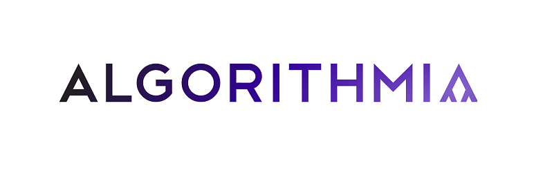

# Algorithmia AI

> Use [Algorithmia](https://algorithmia.com) AI algorithms from the [marketplace](https://algorithmia.com/algorithms) in your WordPress website.

This is WordPress plugin that is both functional (providing three cool algorithms for your WordPress site!) and instructional (meant to give developers a template to follow for adding any arbitrary Algorithmia algorithm to their website).

[Algorithmia](https://algorithmia.com) is a scalable microservices platform that provides AI Algorithms you can call from an API. This plugin uses the Algorithmia PHP client and wraps three of those algorithms (noted below) and provides a template you can use to easily add any algorithm from the marketplace to your website.

> To use, install this plugin onto your WordPress website and add your Algorithmia API key ([sign-up required](https://algorithmia.com/signup)). 

### With this plugin you can enable:

1. Auto-tagging (in alt-text) of uploaded image files - Upload an image file and an algorithm will recognize the objects in your image and add the lables automatically to your alt-text. This is important for SEO and helpful for categorizing your photos.
2. Nudity detection of uploaded image files - An algorithm will detect nudity in an uploaded image and either tag it as 'nudity' in the alt-text or optionally block the upload (depending on your settings).
3. Post summarizer - Every post will be summarized into a brief sentence or two and the summary pre-pended to the post! This is a fun example of how to add your own algorithm to this plugin.

Remember! This plugin is meant to be a platform that developers can use to easily add new algorithms. 
1. First, browse to the [Algorithmia Marketplace](https://algorithmia.com/algorithms) and discover one of the many algorithms available that you want to use in your website.
2. Determine which [WordPress hook or filter](https://adambrown.info/p/wp_hooks) you want to add to insert some artificial intelligence into the workflow.
3. Copy one of the examples that you can find in this plugin's /algorithms directory, rename it and edit it with your developer ninja skills.
4. Repeat! and be amazed at how easy it is to add AI to your site with just a single API call!

## Installation 

The easiest way will be to download and install from the WordPress plugins menu item on your WordPress website. Until then:

1. Clone this repository or upload it to your /wp-content/plugins/algorithmia-ai directory.
2. Activate the plugin through the 'Plugins' screen in WordPress
3. Use the Settings->Algorithmia screen to configure the plugin (including adding in your API key)

## Screenshots

### The object recognition algorithm automatically adds tags to your alt-txt for your image.

### Nudity detection can block images with nudity or just mark them as 'nudity' in the alt-text.

### You can manage these settings in the Settings->Algorithmia admin panel.

### If both nudity detection and object recognition are enabled (and blocking is turned off) then you get alt-txt from both algorithms.

## Write some code!
We hope you take this template and add many new algorithms to the /algorithms directory. As you do, please send us a pull request. We'd love to grow the library of available algorithms for WordPress!

